# Kabletown Sequence Diagrams

This document provides Mermaid sequence diagrams for all major workflows in Kabletown.

---

## 1. Authentication Flow

### User Login (POST /Sessions)

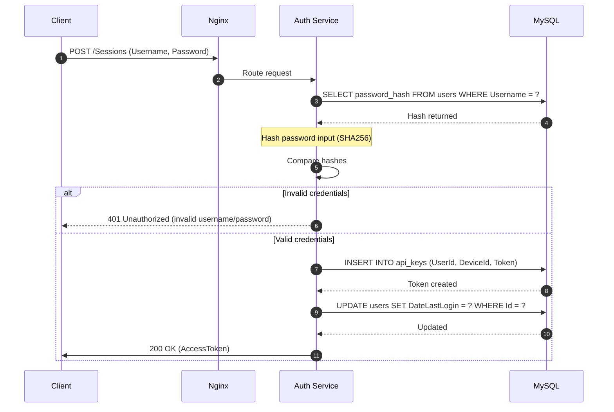
```mermaid
sequenceDiagram
    autonumber
    participant C as Client
    participant N as Nginx
    participant A as Auth Service
    participant DB as MySQL

    C->>N: POST /Sessions (Username, Password)
    N->>A: Route request
    A->>DB: SELECT password_hash FROM users WHERE Username = ?
    DB-->>A: Hash returned
    Note over A: Hash password input (SHA256)
    A->>A: Compare hashes
    alt Invalid credentials
        A-->>C: 401 Unauthorized (invalid username/password)
    else Valid credentials
        A->>DB: INSERT INTO api_keys (UserId, DeviceId, Token)
        DB-->>A: Token created
        A->>DB: UPDATE users SET DateLastLogin = ? WHERE Id = ?
        DB-->>A: Updated
        A->>C: 200 OK (AccessToken)
    end
```

### Token Validation (All Protected Routes)

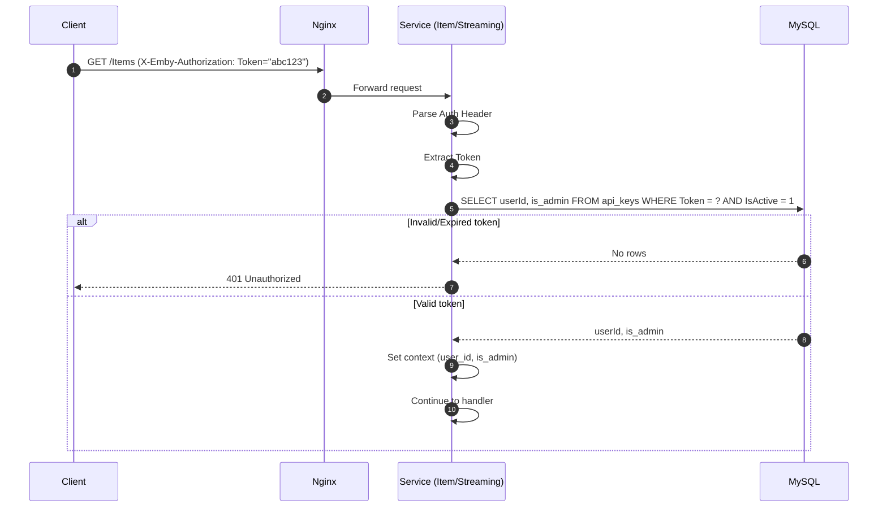
```mermaid
sequenceDiagram
    autonumber
    participant C as Client
    participant N as Nginx
    participant S as Service (Item/Streaming)
    participant DB as MySQL

    C->>N: GET /Items (X-Emby-Authorization: Token="abc123")
    N->>S: Forward request
    S->>S: Parse Auth Header
    S->>S: Extract Token
    S->>DB: SELECT userId, is_admin FROM api_keys WHERE Token = ? AND IsActive = 1
    alt Invalid/Expired token
        DB-->>S: No rows
        S-->>C: 401 Unauthorized
    else Valid token
        DB-->>S: userId, is_admin
        S->>S: Set context (user_id, is_admin)
        S->>S: Continue to handler
    end
```

---

## 2. Item Query Flow

### GET /Items?TopParentId=...&IncludeItemTypes=Movie

```mermaid
sequenceDiagram
    autonumber
    participant C as Client
    participant N as Nginx
    participant IS as Item Service
    participant DB as MySQL

    C->>N: GET /Items?TopParentId=abc123&IncludeItemTypes=Movie&Limit=20&UserId=def456
    N->>IS: Forward request (no auth token in query)
    IS->>IS: Parse Query Params → InternalItemsQuery
    IS->>IS: Validate TopParentId format
    IS->>DB: SELECT b.*, ud.IsPlayed, ud.PlaybackPositionTicks 
           FROM base_items b 
           LEFT JOIN user_data ud ON b.Id = ud.ItemId AND ud.UserId = ?
           WHERE b.TopParentId = ? AND b.Type = 'Movie'
           ORDER BY b.DateCreated DESC
           LIMIT 20
    DB-->>IS: Rows returned (20 items)
    IS->>IS: Serialize to BaseItemDto[]
    IS->>IS: Wrap in QueryResult (TotalRecordCount, StartIndex)
    IS-->>C: 200 OK (QueryResult)
```

### Get Recently Added Items

```mermaid
sequenceDiagram
    autonumber
    participant C as Client
    participant N as Nginx
    participant IS as Item Service
    participant DB as MySQL

    C->>N: GET /Items/RecentlyAdded?UserId=abc123&Limit=20
    N->>IS: Forward request
    IS->>DB: SELECT b.*, ud.IsPlayed, ud.PlaybackPositionTicks
           FROM base_items b
           LEFT JOIN user_data ud ON b.Id = ud.ItemId AND ud.UserId = ?
           WHERE b.Type != 'Folder' AND DateCreated > SUBDATE(NOW(), 30)
           ORDER BY b.DateCreated DESC
           LIMIT 20
    DB-->>IS: 20 most recently created items
    IS->>IS: Build BaseItemDto[] with UserDatas
    IS->>IS: Sort by DateCreated (ensure correct order)
    IS-->>C: 200 OK {"Items": [...], "TotalRecordCount": 20}
```

### Item Query with P6 Filters (Genre)

```mermaid
sequenceDiagram
    autonumber
    participant C as Client
    participant N as Nginx
    participant IS as Item Service
    participant DB as MySQL

    C->>N: GET /Items?IncludeItemTypes=Movie&GenreIds=action,scifi
    N->>IS: Forward request
    IS->>IS: Parse GenreIds → ["action", "scifi"]
    IS->>DB: SELECT b.* 
           FROM base_items b
           INNER JOIN item_values iv ON b.Id = iv.ItemId
           WHERE b.Type = 'Movie'
           AND iv.ValueType = 2  -- Genre
           AND iv.NormalizedValue IN ('action', 'scifi')
           GROUP BY b.Id  -- Duplicates if movie has both genres
           HAVING COUNT(DISTINCT iv.NormalizedValue) = 2  -- Must match ALL
           LIMIT 20
    DB-->>IS: Movies matching both genres
    IS->>IS: De-duplicate and serialize
    IS-->>C: 200 OK (Filtered results)
```

---

## 3. HLS Streaming Flow

### Initial Request: GET /Videos/{itemId}/master.m3u8

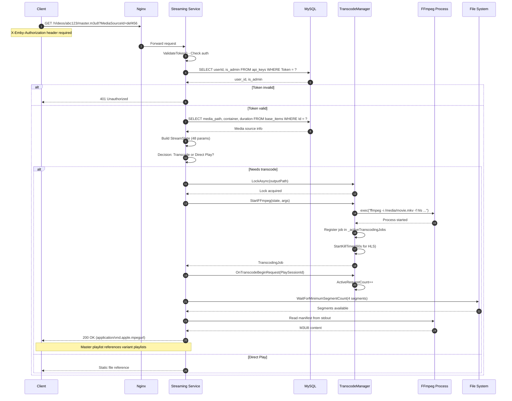
```mermaid
sequenceDiagram
    autonumber
    participant C as Client
    participant N as Nginx
    participant SS as Streaming Service
    participant DB as MySQL
    participant TM as TranscodeManager
    participant FFmpeg as FFmpeg Process
    participant FS as File System

    C->>N: GET /Videos/abc123/master.m3u8?MediaSourceId=def456
    Note over C: X-Emby-Authorization header required
    N->>SS: Forward request
    SS->>SS: ValidateToken() - Check auth
    SS->>DB: SELECT userId, is_admin FROM api_keys WHERE Token = ?
    DB-->>SS: user_id, is_admin
    alt Token invalid
        SS-->>C: 401 Unauthorized
    else Token valid
        SS->>DB: SELECT media_path, container, duration FROM base_items WHERE Id = ?
        DB-->>SS: Media source info
        SS->>SS: Build StreamState (48 params)
        SS->>SS: Decision: Transcode or Direct Play?
        
        alt Needs transcode
            SS->>TM: LockAsync(outputPath)
            TM-->>SS: Lock acquired
            SS->>TM: StartFFmpeg(state, args)
            TM->>FFmpeg: exec("ffmpeg -i /media/movie.mkv -f hls ...")
            FFmpeg-->>TM: Process started
            TM->>TM: Register job in _activeTranscodingJobs
            TM->>TM: StartKillTimer(60s for HLS)
            TM-->>SS: TranscodingJob
            SS->>TM: OnTranscodeBeginRequest(PlaySessionId)
            TM->>TM: ActiveRequestCount++
            SS->>FS: WaitForMinimumSegmentCount(4 segments)
            FS-->>SS: Segments available
            SS->>FFmpeg: Read manifest from stdout
            FFmpeg-->>SS: M3U8 content
            SS-->>C: 200 OK (application/vnd.apple.mpegurl)
            Note over C,SS: Master playlist references variant playlists
        else Direct Play
            SS-->>C: Static file reference
        end
    end
```

### HLS Segment Request: GET /Videos/{itemId}/hls/{playlistId}/{segmentId}.ts

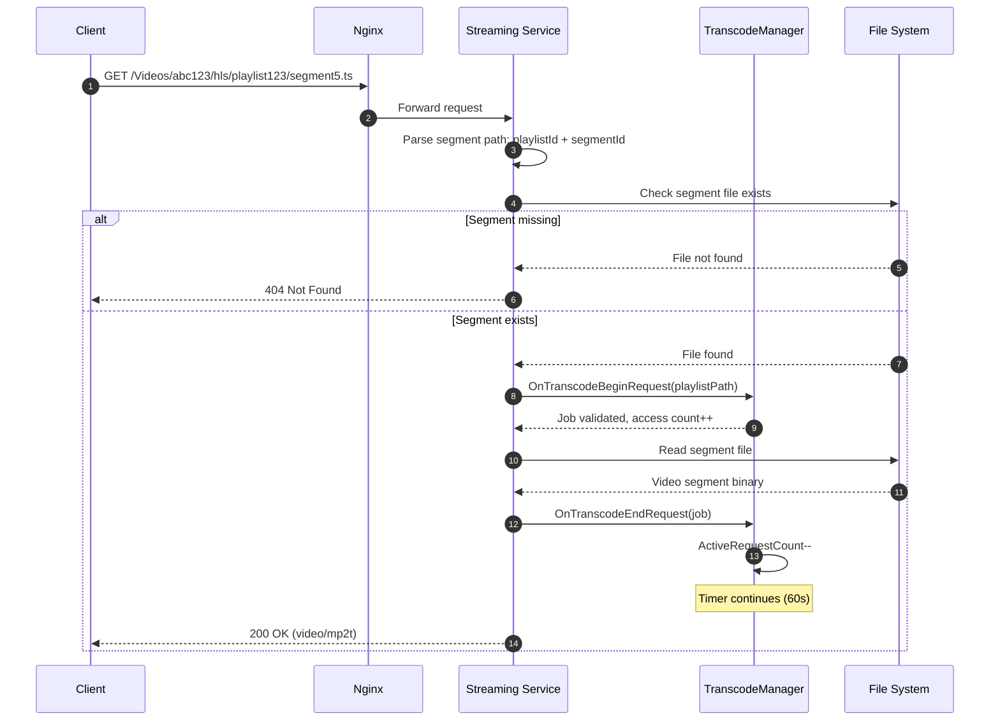
```mermaid
sequenceDiagram
    autonumber
    participant C as Client
    participant N as Nginx
    participant SS as Streaming Service
    participant TM as TranscodeManager
    participant FS as File System

    C->>N: GET /Videos/abc123/hls/playlist123/segment5.ts
    N->>SS: Forward request
    SS->>SS: Parse segment path: playlistId + segmentId
    SS->>FS: Check segment file exists
    alt Segment missing
        FS-->>SS: File not found
        SS-->>C: 404 Not Found
    else Segment exists
        FS-->>SS: File found
        SS->>TM: OnTranscodeBeginRequest(playlistPath)
        TM-->>SS: Job validated, access count++
        SS->>FS: Read segment file
        FS-->>SS: Video segment binary
        SS->>TM: OnTranscodeEndRequest(job)
        TM->>TM: ActiveRequestCount--
        Note over TM: Timer continues (60s)
        SS-->>C: 200 OK (video/mp2t)
    end
```

### HLS Client Disconnects (No More Requests)

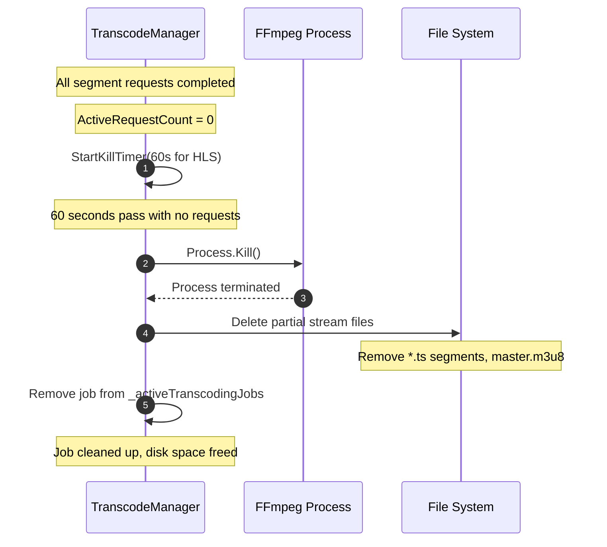
```mermaid
sequenceDiagram
    autonumber
    participant TM as TranscodeManager
    participant FFmpeg as FFmpeg Process
    participant FS as File System

    Note over TM: All segment requests completed
    Note over TM: ActiveRequestCount = 0
    TM->>TM: StartKillTimer(60s for HLS)
    
    Note over TM: 60 seconds pass with no requests
    TM->>FFmpeg: Process.Kill()
    FFmpeg-->>TM: Process terminated
    TM->>FS: Delete partial stream files
    Note over FS: Remove *.ts segments, master.m3u8
    TM->>TM: Remove job from _activeTranscodingJobs
    Note over TM: Job cleaned up, disk space freed
```

---

## 4. Progressive Streaming Flow

### Direct Play: GET /Videos/{itemId}/stream?Static=true

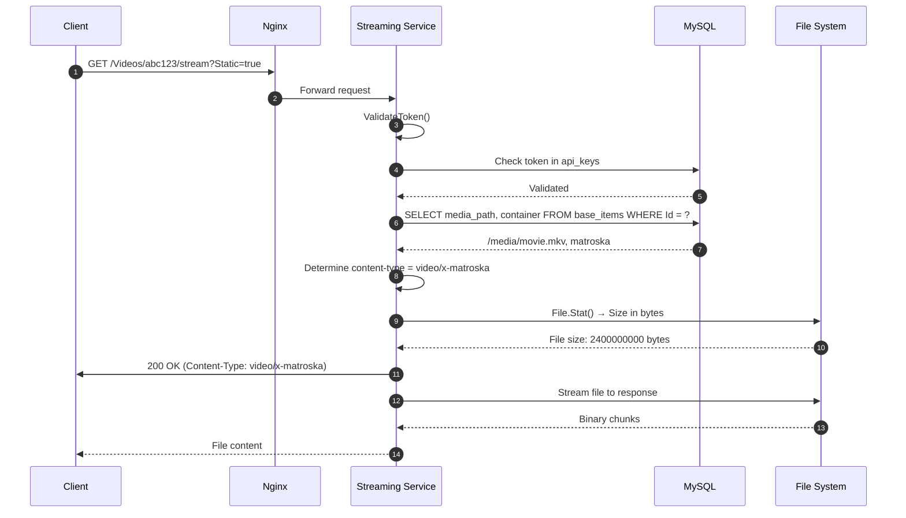
```mermaid
sequenceDiagram
    autonumber
    participant C as Client
    participant N as Nginx
    participant SS as Streaming Service
    participant DB as MySQL
    participant FS as File System

    C->>N: GET /Videos/abc123/stream?Static=true
    N->>SS: Forward request
    SS->>SS: ValidateToken()
    SS->>DB: Check token in api_keys
    DB-->>SS: Validated
    SS->>DB: SELECT media_path, container FROM base_items WHERE Id = ?
    DB-->>SS: /media/movie.mkv, matroska
    SS->>SS: Determine content-type = video/x-matroska
    SS->>FS: File.Stat() → Size in bytes
    FS-->>SS: File size: 2400000000 bytes
    SS->>C: 200 OK (Content-Type: video/x-matroska)
    SS->>FS: Stream file to response
    FS-->>SS: Binary chunks
    SS-->>C: File content
```

### Transcode: GET /Videos/{itemId}/stream?VideoCodec=h264

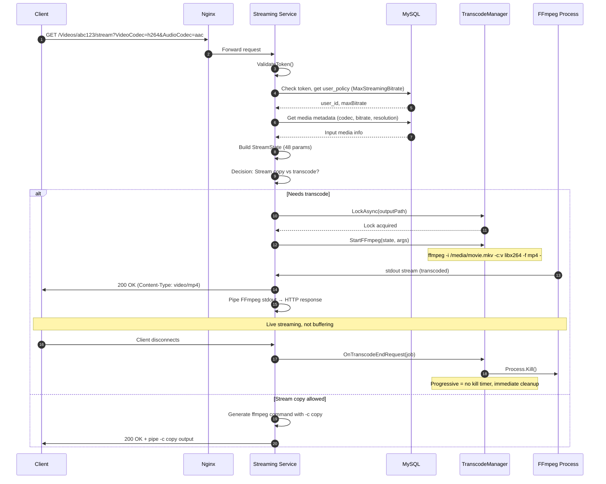
```mermaid
sequenceDiagram
    autonumber
    participant C as Client
    participant N as Nginx
    participant SS as Streaming Service
    participant DB as MySQL
    participant TM as TranscodeManager
    participant FFmpeg as FFmpeg Process

    C->>N: GET /Videos/abc123/stream?VideoCodec=h264&AudioCodec=aac
    N->>SS: Forward request
    SS->>SS: ValidateToken()
    SS->>DB: Check token, get user_policy (MaxStreamingBitrate)
    DB-->>SS: user_id, maxBitrate
    SS->>DB: Get media metadata (codec, bitrate, resolution)
    DB-->>SS: Input media info
    SS->>SS: Build StreamState (48 params)
    SS->>SS: Decision: Stream copy vs transcode?
    
    alt Needs transcode
        SS->>TM: LockAsync(outputPath)
        TM-->>SS: Lock acquired
        SS->>TM: StartFFmpeg(state, args)
        Note over TM: ffmpeg -i /media/movie.mkv -c:v libx264 -f mp4 -
        FFmpeg->>SS: stdout stream (transcoded)
        SS->>C: 200 OK (Content-Type: video/mp4)
        SS->>SS: Pipe FFmpeg stdout → HTTP response
        Note over C,FFmpeg: Live streaming, not buffering
        C->>SS: Client disconnects
        SS->>TM: OnTranscodeEndRequest(job)
        TM->>FFmpeg: Process.Kill()
        Note over TM: Progressive = no kill timer, immediate cleanup
    else Stream copy allowed
        SS->>SS: Generate ffmpeg command with -c copy
        SS->>C: 200 OK + pipe -c copy output
    end
```

---

## 5. FFmpeg Process Lifecycle

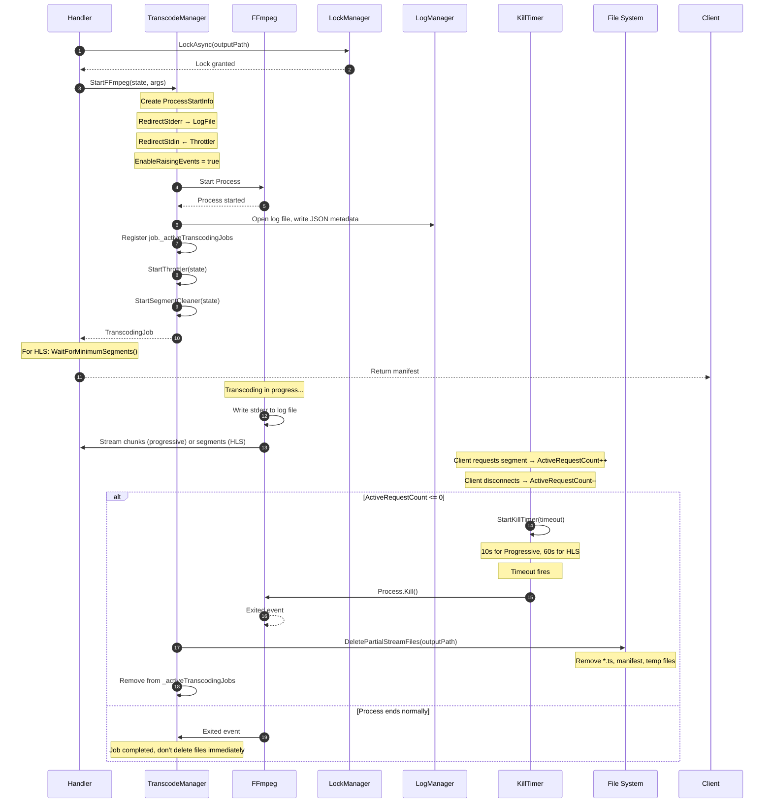
```mermaid
sequenceDiagram
    autonumber
    participant Handler as Handler
    participant TM as TranscodeManager
    participant FFmpeg as FFmpeg
    participant LockMgr as LockManager
    participant LogMgr as LogManager
    participant Timer as KillTimer
    participant FS as File System

    Handler->>LockMgr: LockAsync(outputPath)
    LockMgr-->>Handler: Lock granted
    Handler->>TM: StartFFmpeg(state, args)
    
    Note over TM: Create ProcessStartInfo
    Note over TM: RedirectStderr → LogFile
    Note over TM: RedirectStdin ← Throttler
    Note over TM: EnableRaisingEvents = true
    
    TM->>FFmpeg: Start Process
    FFmpeg-->>TM: Process started
    TM->>LogMgr: Open log file, write JSON metadata
    TM->>TM: Register job._activeTranscodingJobs
    TM->>TM: StartThrottler(state)  # If file 5min+
    TM->>TM: StartSegmentCleaner(state)  # If HLS 5min+
    TM-->>Handler: TranscodingJob
    
    Note over Handler: For HLS: WaitForMinimumSegments()
    Handler-->>Client: Return manifest
    
    Note over FFmpeg: Transcoding in progress...
    FFmpeg->>FFmpeg: Write stderr to log file
    FFmpeg->>Handler: Stream chunks (progressive) or segments (HLS)
    
    Note over Timer: Client requests segment → ActiveRequestCount++
    Note over Timer: Client disconnects → ActiveRequestCount--
    
    alt ActiveRequestCount <= 0
        Timer->>Timer: StartKillTimer(timeout)
        Note over Timer: 10s for Progressive, 60s for HLS
        
        Note over Timer: Timeout fires
        Timer->>FFmpeg: Process.Kill()
        FFmpeg-->>FFmpeg: Exited event
        TM->>FS: DeletePartialStreamFiles(outputPath)
        Note over FS: Remove *.ts, manifest, temp files
        TM->>TM: Remove from _activeTranscodingJobs
    else Process ends normally
        FFmpeg->>TM: Exited event
        Note over TM: Job completed, don't delete files immediately
    end
```

---

## 6. Transcode Decision Flow

### Stream Copy vs Transcode Decision

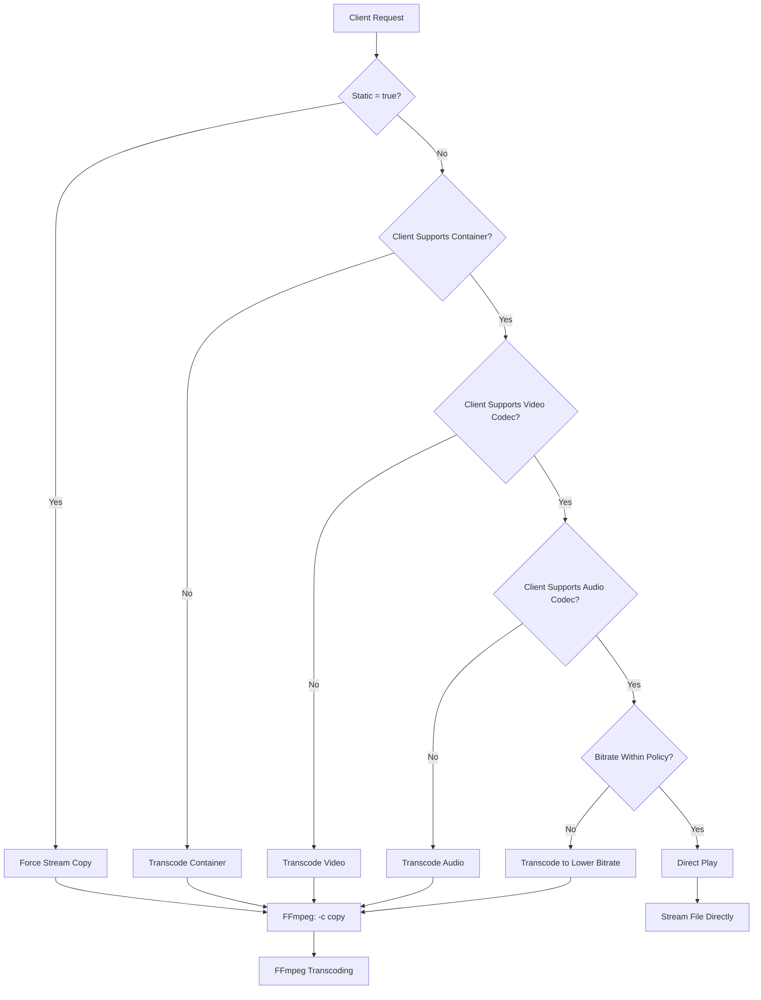
```mermaid
flowchart TD
    A[Client Request] --> B{Static = true?}
    B -->|Yes| C[Force Stream Copy]
    B -->|No| D{Client Supports Container?}
    D -->|No| E[Transcode Container]
    D -->|Yes| F{Client Supports Video Codec?}
    F -->|No| G[Transcode Video]
    F -->|Yes| H{Client Supports Audio Codec?}
    H -->|No| I[Transcode Audio]
    H -->|Yes| J{Bitrate Within Policy?}
    J -->|No| K[Transcode to Lower Bitrate]
    J -->|Yes| L[Direct Play]
    
    C --> Z[FFmpeg: -c copy]
    E --> Z
    G --> Z
    I --> Z
    K --> Z
    L --> M[Stream File Directly]
    
    Z --> N[FFmpeg Transcoding]
```

### Decision Logic Details

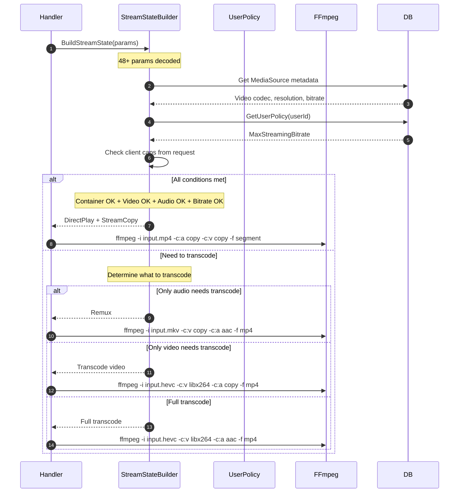
```mermaid
sequenceDiagram
    autonumber
    participant Handler as Handler
    participant Builder as StreamStateBuilder
    participant Policy as UserPolicy
    participant FFmpeg as FFmpeg

    Handler->>Builder: BuildStreamState(params)
    Note over Builder: 48+ params decoded
    Builder->>DB: Get MediaSource metadata
    DB-->>Builder: Video codec, resolution, bitrate
    Builder->>DB: GetUserPolicy(userId)
    DB-->>Builder: MaxStreamingBitrate
    Builder->>Builder: Check client caps from request
    
    alt All conditions met
        Note over Builder: Container OK + Video OK + Audio OK + Bitrate OK
        Builder-->>Handler: DirectPlay + StreamCopy
        Handler->>FFmpeg: ffmpeg -i input.mp4 -c:a copy -c:v copy -f segment
    else Need to transcode
        Note over Builder: Determine what to transcode
        alt Only audio needs transcode
            Builder-->>Handler: Remux
            Handler->>FFmpeg: ffmpeg -i input.mkv -c:v copy -c:a aac -f mp4
        else Only video needs transcode
            Builder-->>Handler: Transcode video
            Handler->>FFmpeg: ffmpeg -i input.hevc -c:v libx264 -c:a copy -f mp4
        else Full transcode
            Builder-->>Handler: Full transcode
            Handler->>FFmpeg: ffmpeg -i input.hevc -c:v libx264 -c:a aac -f mp4
        end
    end
```

---

## 7. Error Handling Flow

### 401 Unauthorized Flow

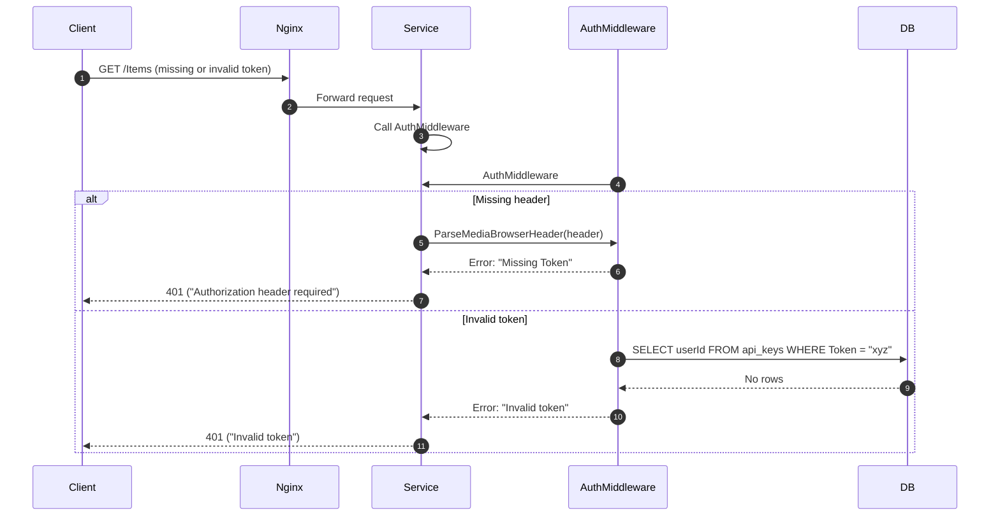
```mermaid
sequenceDiagram
    autonumber
    participant C as Client
    participant N as Nginx
    participant S as Service
    participant AuthMiddleware as AuthMiddleware

    C->>N: GET /Items (missing or invalid token)
    N->>S: Forward request
    S->>S: Call AuthMiddleware
    AuthMiddleware->>S: AuthMiddleware
    alt Missing header
        S->>AuthMiddleware: ParseMediaBrowserHeader(header)
        AuthMiddleware-->>S: Error: "Missing Token"
        S-->>C: 401 ("Authorization header required")
    else Invalid token
        AuthMiddleware->>DB: SELECT userId FROM api_keys WHERE Token = "xyz"
        DB-->>AuthMiddleware: No rows
        AuthMiddleware-->>S: Error: "Invalid token"
        S-->>C: 401 ("Invalid token")
    end
```

### 404 Not Found Flow

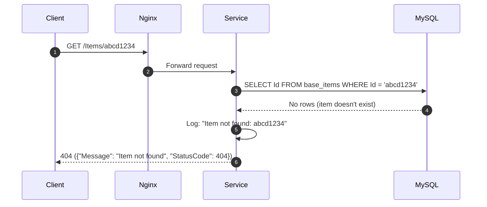
```mermaid
sequenceDiagram
    autonumber
    participant C as Client
    participant N as Nginx
    participant S as Service
    participant DB as MySQL

    C->>N: GET /Items/abcd1234
    N->>S: Forward request
    S->>DB: SELECT Id FROM base_items WHERE Id = 'abcd1234'
    DB-->>S: No rows (item doesn't exist)
    S->>S: Log: "Item not found: abcd1234"
    S-->>C: 404 ({"Message": "Item not found", "StatusCode": 404})
```

### FFmpeg Failure Flow

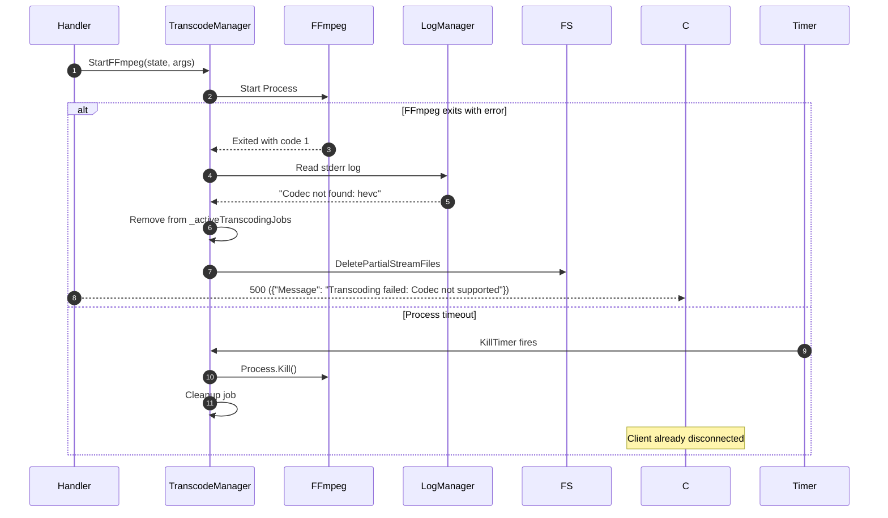
```mermaid
sequenceDiagram
    autonumber
    participant Handler as Handler
    participant TM as TranscodeManager
    participant FFmpeg as FFmpeg
    participant LogMgr as LogManager

    Handler->>TM: StartFFmpeg(state, args)
    TM->>FFmpeg: Start Process
    alt FFmpeg exits with error
        FFmpeg-->>TM: Exited with code 1
        TM->>LogMgr: Read stderr log
        LogMgr-->>TM: "Codec not found: hevc"
        TM->>TM: Remove from _activeTranscodingJobs
        TM->>FS: DeletePartialStreamFiles
        Handler-->>C: 500 ({"Message": "Transcoding failed: Codec not supported"})
    else Process timeout
        Timer->>TM: KillTimer fires
        TM->>FFmpeg: Process.Kill()
        TM->>TM: Cleanup job
        Note over C: Client already disconnected
    end
```

---

## 8. Health Check Flow

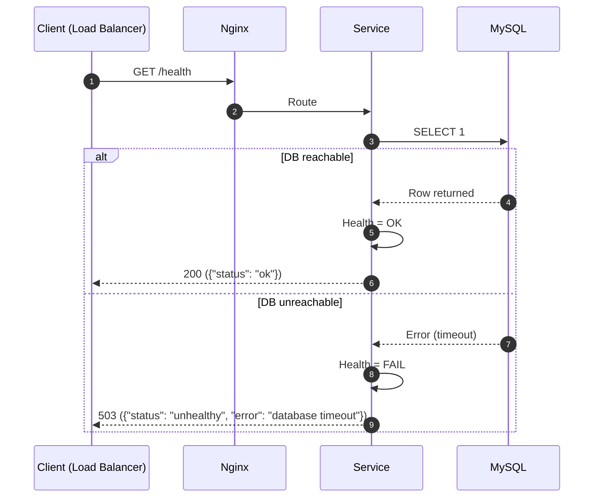
```mermaid
sequenceDiagram
    autonumber
    participant C as Client (Load Balancer)
    participant N as Nginx
    participant S as Service
    participant DB as MySQL

    C->>N: GET /health
    N->>S: Route
    S->>DB: SELECT 1
    alt DB reachable
        DB-->>S: Row returned
        S->>S: Health = OK
        S-->>C: 200 ({"status": "ok"})
    else DB unreachable
        DB-->>S: Error (timeout)
        S->>S: Health = FAIL
        S-->>C: 503 ({"status": "unhealthy", "error": "database timeout"})
    end
```

---

## 9. Cleanup Flow

### Automated Transcode Cleanup (Periodic)

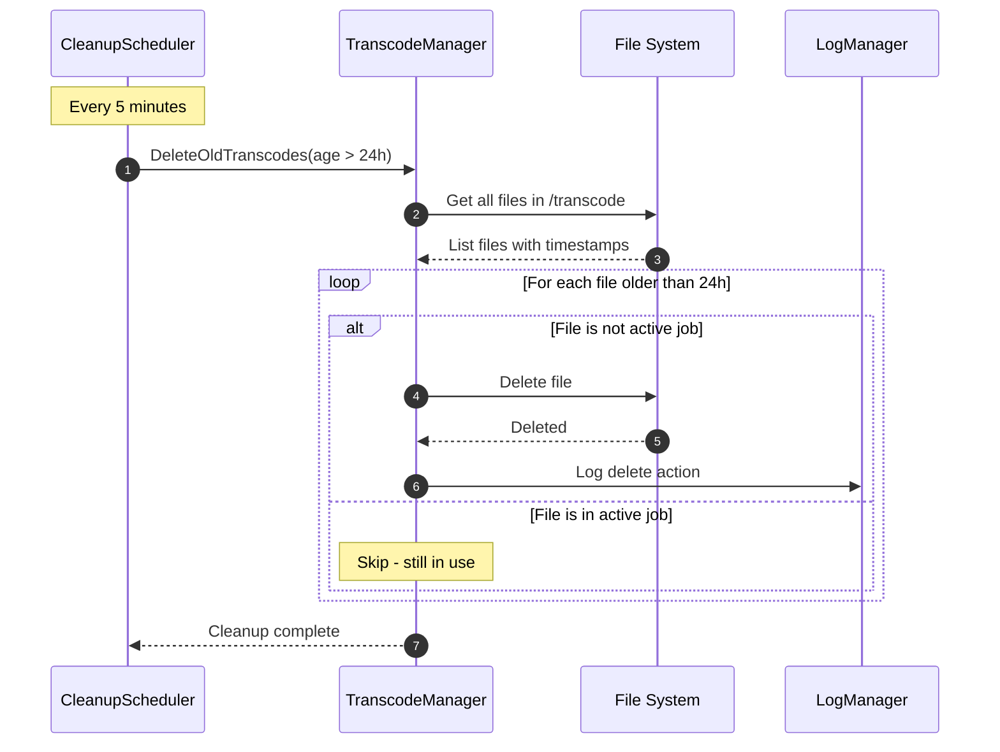
```mermaid
sequenceDiagram
    autonumber
    participant Scheduler as CleanupScheduler
    participant TM as TranscodeManager
    participant FS as File System
    participant LogMgr as LogManager

    Note over Scheduler: Every 5 minutes
    Scheduler->>TM: DeleteOldTranscodes(age > 24h)
    TM->>FS: Get all files in /transcode
    FS-->>TM: List files with timestamps
    
    loop For each file older than 24h
        alt File is not active job
            TM->>FS: Delete file
            FS-->>TM: Deleted
            TM->>LogMgr: Log delete action
        else File is in active job
            Note over TM: Skip - still in use
        end
    end
    
    TM-->>Scheduler: Cleanup complete
```

---

## 10. Migration Flow (Jellyfin → Kabletown)

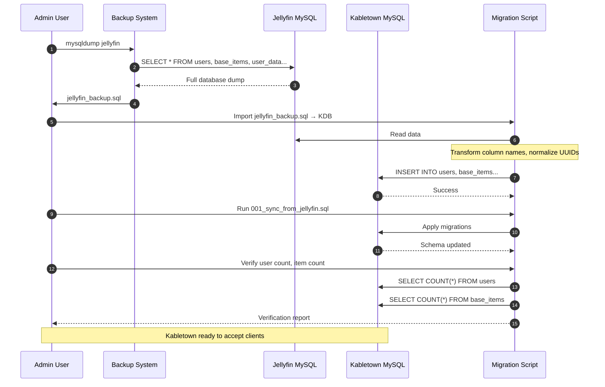
```mermaid
sequenceDiagram
    autonumber
    participant Admin as Admin User
    participant Backup as Backup System
    participant JDB as Jellyfin MySQL
    participant KDB as Kabletown MySQL
    participant Script as Migration Script

    Admin->>Backup: mysqldump jellyfin
    Backup->>JDB: SELECT * FROM users, base_items, user_data...
    JDB-->>Backup: Full database dump
    Backup->>Admin: jellyfin_backup.sql
    
    Admin->>Script: Import jellyfin_backup.sql → KDB
    Script->>JDB: Read data
    Note over Script: Transform column names, normalize UUIDs
    Script->>KDB: INSERT INTO users, base_items...
    KDB-->>Script: Success
    
    Admin->>Script: Run 001_sync_from_jellyfin.sql
    Script->>KDB: Apply migrations
    KDB-->>Script: Schema updated
    
    Admin->>Script: Verify user count, item count
    Script->>KDB: SELECT COUNT(*) FROM users
    Script->>KDB: SELECT COUNT(*) FROM base_items
    Script-->>Admin: Verification report
    
    Note over Admin,KDB: Kabletown ready to accept clients
```

---

## Legend

| Symbol | Meaning |
|--------|---|-|
| `[Rectangular Box]` | System Component |
| `(Rounded Rect)` | Process/Action |
| `→` | Synchronous Call |
| `-->>` | Response |
| `Note over` | Annotation/State |
| `alt` | Conditional Branch |
| `loop` | Iteration |
| `par` | Parallel Execution |
